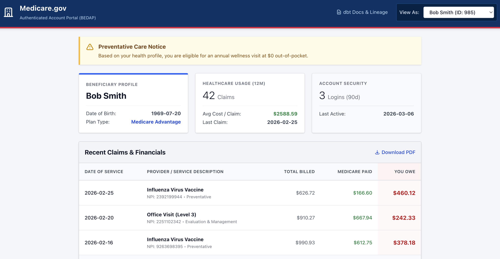

# Mini BEDAP: Beneficiary Experience Data Platform Demo

This repository is a small end-to-end demo of a beneficiary-facing analytics platform inspired by the authenticated Medicare account experience. It uses dbt and DuckDB to transform synthetic beneficiary, claims, and account activity data into frontend-ready models, then exports flat JSON files that are served directly by a React application.


The project is designed to demonstrate:
- Data modeling with dbt.
- Layered transformations across staging, intermediate rollups, and marts.
- Data quality checks that act as circuit breakers before publishing data to the UI.
- A backend-for-frontend pattern where the ELT pipeline produces flat files for direct frontend consumption.
- Lightweight orchestration locally and in CI using shell scripts and GitHub Actions.

## Architecture

The repository is organized as a monorepo with two primary applications:

- `bedap-dbt/`: The analytics engineering project. This contains seeds, staging models, intermediate rollups, marts, and tests.
- `bedap-ui/`: The React frontend. This serves a mock authenticated dashboard with a "view as" selector for switching among synthetic beneficiaries.

The data flow is:

1. Seed raw CSV files into DuckDB.
2. Run dbt staging models to cast and standardize the raw records.
3. Build intermediate rollups at the beneficiary grain.
4. Build mart models used by the UI.
5. Run tests to validate integrity and business rules.
6. Generate dbt docs.
7. Export mart outputs to flat JSON files in `bedap-ui/public/data/`.
8. Serve the React app and static dbt docs.

## Repository layout

```text
.
├── bedap-dbt/
│   ├── dbt_project.yml
│   ├── profiles.yml
│   ├── models/
│   │   ├── staging/
│   │   ├── intermediate/
│   │   └── marts/
│   ├── seeds/
│   └── tests/
├── bedap-ui/
│   ├── public/
│   │   ├── data/
│   │   └── docs/
│   └── src/
├── export_bff.sh
├── run_local.sh
└── .github/
    └── workflows/
```

## Modeling conventions

This project follows a layered dbt naming convention:

- Seeds represent raw inputs.
- `stg_` models cast types and normalize source fields.
- `int_` models with a `_rollup` suffix aggregate granular data to a business grain.
- Mart models expose frontend-ready entities and drill-down views.

Examples:
- `stg_medicare__claim`
- `int_beneficiary_claim_rollup`
- `int_beneficiary_event_rollup`
- `medicare__beneficiary_profile`
- `medicare__claim_detail`
- `medicare__engagement_log`

The key design principle is that marts should depend on staging or intermediate models rather than raw seed inputs directly.

## Data model overview

The main UI is powered by three mart models:

### `medicare__beneficiary_profile`
A summary model at the beneficiary grain used for the dashboard header and summary cards.

Sample fields:
- `beneficiary_id`
- `beneficiary_name`
- `dob`
- `plan_type`
- `chronic_conditions`
- `claims_12m`
- `avg_claim_cost`
- `last_claim_date`
- `logins_90d`
- `last_interaction`

### `medicare__claim_detail`
A drill-down model for claims and financials.

Sample fields:
- `claim_id`
- `beneficiary_id`
- `claim_date`
- `provider_npi`
- `service_code`
- `service_description`
- `service_category`
- `allowed_amount`
- `medicare_paid_amount`
- `beneficiary_responsibility_amount`
- `requires_payment_flag`

### `medicare__engagement_log`
A drill-down model for beneficiary activity.

Sample fields:
- `event_id`
- `beneficiary_id`
- `event_type`
- `event_timestamp`
- `event_category`
- `days_since_last_event`

## Quality checks

This project includes both schema tests and business-rule tests.

Examples:
- Unique and non-null identifiers on claims, beneficiaries, and events.
- Referential integrity between claim and beneficiary records.
- Accepted values for event and service categories.
- Financial guardrails such as preventing paid amounts from exceeding allowed amounts.
- Temporal checks such as preventing future-dated events.

These tests are intended to simulate pipeline circuit breakers so that invalid data does not get published to the frontend.

## Frontend



The React app is a static dashboard that reads JSON files exported by the data pipeline. It includes:

- A "view as" selector that switches among synthetic beneficiaries.
- A profile summary area.
- A claims and financial drill-down.
- A styling approach modeled on accessible government service design patterns.
- A link to static dbt docs generated during the pipeline run.

Because the frontend reads static JSON files, no live application database or API server is required for the demo.

## Local setup

### Prerequisites

- Python 3.11+
- Node.js 20+
- `dbt-duckdb`
- DuckDB CLI
- npm

### Install dependencies

```bash
pip install dbt-duckdb
cd bedap-ui
npm install
cd ..
```

### Run the full local pipeline

From the repo root:

```bash
chmod +x run_local.sh
./run_local.sh
```

This script will:
1. Seed the data into DuckDB.
2. Build dbt staging, intermediate, and mart models.
3. Run tests.
4. Generate dbt docs.
5. Copy dbt docs into the frontend static folder.
6. Export mart data to flat JSON files.
7. Launch the React development server.

### Run dbt manually

```bash
cd bedap-dbt
dbt seed --profiles-dir .
dbt build --profiles-dir .
dbt docs generate --profiles-dir .
cd ..
./export_bff.sh
```

### Run the frontend manually

```bash
cd bedap-ui
npm run dev
```

## Deployment

The repository includes a GitHub Actions workflow that:

1. Runs the dbt pipeline.
2. Executes tests.
3. Generates dbt docs.
4. Exports mart outputs to JSON.
5. Builds the React app.
6. Deploys the static site to GitHub Pages.

When deployed, the app uses Vite's base URL support so JSON assets and dbt docs resolve correctly under the repository subpath.

## Why this design

This demo intentionally avoids unnecessary infrastructure.

- DuckDB keeps the warehouse local and portable.
- dbt provides modular SQL transformations and documentation.
- Flat JSON exports eliminate the need for a live API or database for demo purposes.
- GitHub Actions simulates a lightweight orchestration workflow.
- The UI reflects how curated analytical models can directly support an authenticated beneficiary experience.

## Notes

This repository uses synthetic data only. It is intended as a demonstration of architecture, modeling patterns, quality controls, and frontend integration rather than as a production healthcare system.
