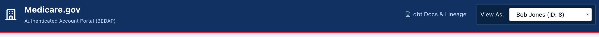
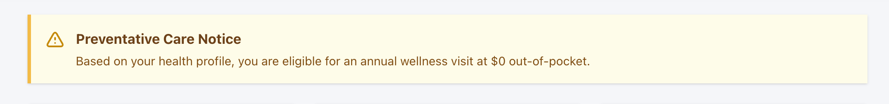
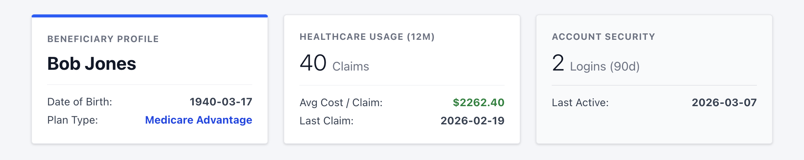
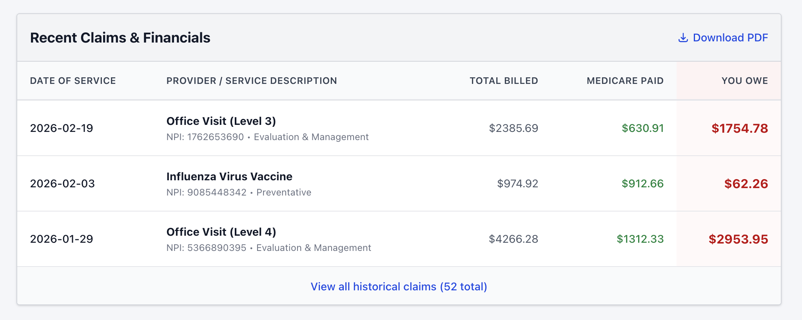
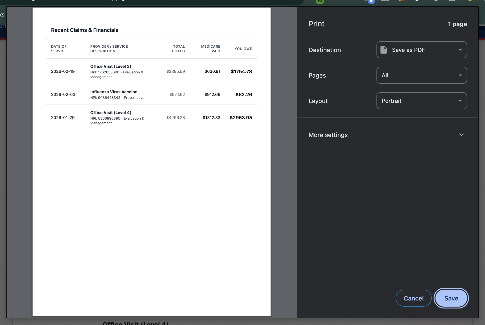
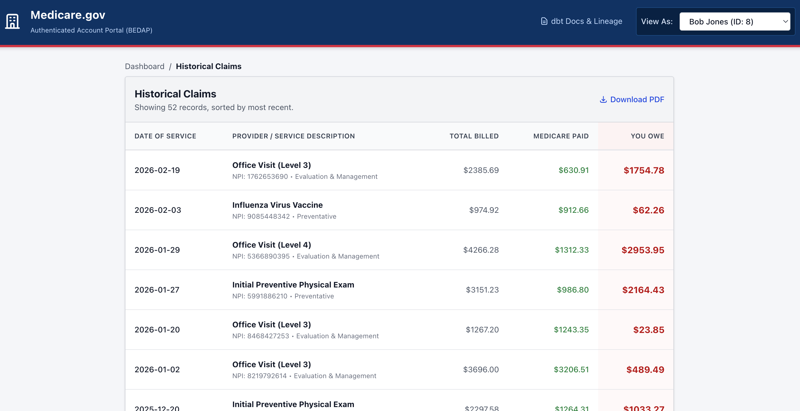
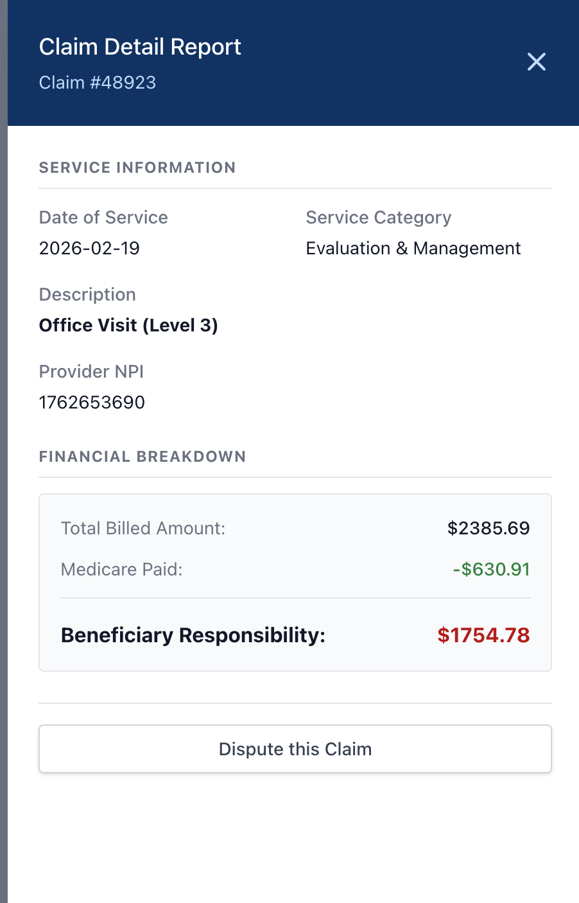

# BEDAP Authenticated Portal: Component Explainer

This document provides a component-by-component breakdown of the Beneficiary Experience Data Analytics Platform (BEDAP) prototype. The UI is built with React and Tailwind CSS, entirely driven by flat JSON APIs exported directly from our dbt data marts.

*For this walkthrough, we will view the portal from the perspective of **Bob Jones (ID: 8)**, a simulated Medicare beneficiary.*

---

## 1. Global Header & View Switcher
The header anchors the user experience, utilizing the official USWDS (U.S. Web Design System) color palette (`#003366` Navy, `#e31c3d` Red accent).

* **dbt Docs & Lineage Link:** Connects the frontend directly to the data engineering backend, opening the statically hosted dbt documentation in a new tab.
* **"View As" Dropdown:** Demonstrates the multi-tenant capability of the data model. Selecting Bob Jones (ID: 8) instantly triggers a React state update that filters the local `beneficiaries.json` and `claims.json` payloads, re-rendering all downstream components in milliseconds.

---

## 2. Dynamic Alert System (Business Logic)
This component demonstrates how upstream data modeling directly influences frontend logic without hardcoding business rules into the React app.

* **How it works:** The React frontend simply evaluates `{Number(currentUser.chronic_conditions) >= 2}`. 
* **The Data Engineering Magic:** The heavy lifting of calculating *how many* chronic conditions a beneficiary has is handled upstream in the dbt `int_beneficiary_event_rollup` model. If Bob Jones' clinical data indicates high risk, the alert appears. If we switch to a healthy beneficiary, it instantly disappears.

---

## 3. Beneficiary Profile Cards
Three summary cards sit at the top of the dashboard, serving as a high-level executive summary of the beneficiary's interactions with the Medicare system.

These cards are powered entirely by the `medicare__beneficiary_profile` dbt mart (One Big Table concept). 
* **Beneficiary Profile:** Static dimensional data (`dob`, `plan_type`).
* **Healthcare Usage:** Aggregated financial and volume metrics (`claims_12m`, `avg_claim_cost`).
* **Account Security:** Behavioral analytics aggregated from the `account_event` seed, representing the `logins_90d` and `last_interaction` timestamp.

---

## 4. Recent Claims Drill-Down (The Slice)
A highly legible financial ledger showing the most recent interactions with healthcare providers.

* **Component Logic:** The React app takes Bob Jones' full history, sorts it chronologically by `claim_date` descending, and applies a strict `.slice(0, 3)` to ensure the dashboard remains uncluttered.
* **Financial Formatting:** Billed amounts, Medicare payouts, and Beneficiary Responsibility amounts are dynamically cast to numbers and constrained to `.toFixed(2)` to ensure strict currency formatting (e.g., `$1,240.50`). 
* **Visual Cues:** If the `requires_payment_flag` is true, the text turns red. If false, it renders as a muted `$0.00`.

---

## 5. PDF Export Engine
Demonstrates critical "save for my records" functionality required by real-world Medicare beneficiaries.

* **How it works:** Rather than bloating the application with heavy third-party canvas libraries, the UI utilizes browser-native `window.print()` combined with Tailwind CSS `@media print` modifiers.
* **Implementation:** Utility classes like `print:hidden` strip away the navigation header and buttons, while `print:bg-white` and `print:border-black` convert the shaded web UI into a crisp, ink-friendly financial report.

---

## 6. Historical Claims View
When the user clicks "View all historical claims", the dashboard component unmounts and the full historical table mounts.

* **Routing Simulation:** Because this is a statically hosted GitHub Pages site without server-side routing, React state (`currentView = 'history'`) is used to mock a seamless page transition without triggering a hard browser reload.
* **Data Mapping:** Maps over the fully unfiltered, chronologically sorted `userClaims` array.

---

## 7. Slide-Over Detail Panel
Provides deep-dive clinical and financial context without forcing the user to navigate away from their historical ledger.

* **UX Design:** Uses a Tailwind CSS off-canvas drawer pattern with a semi-transparent background overlay.
* **State Management:** Clicking a table row sets the `selectedClaim` state object. The panel reads directly from this object to populate the "Service Information" and "Financial Breakdown" definition lists.
* **Interactivity:** Clicking the background overlay, the 'X' icon, or selecting a different user from the header immediately resets the state and smoothly glides the panel out of view.
